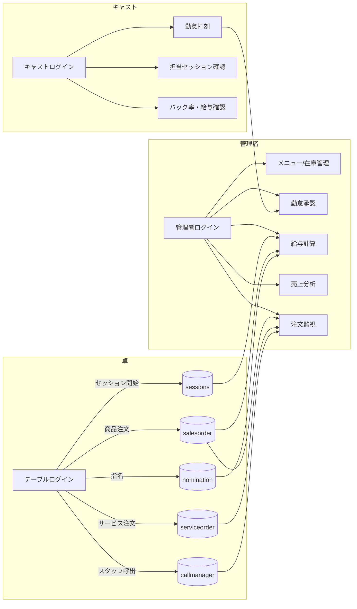
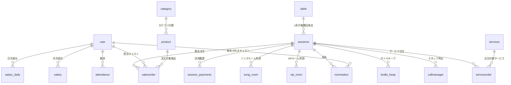

<div align="center">


### ナイトワーク特化型 統合POSシステム

**テーブルファースト設計** で、キャストがその場で注文・指名・バック率計算まで完結できる、キャバクラ・ラウンジ向けの業務システムです。

[](https://nextjs.org/)
[](https://www.typescriptlang.org/)
[](https://www.postgresql.org/)
[](https://tailwindcss.com/)
[](#-ライセンス--著作権)

</div>


## 📋 目次

- [概要](#-概要)
- [主要機能](#-主要機能)
- [技術スタック](#-技術スタック)
- [システム構成](#-システム構成)
- [データベース設計](#-データベース設計)
- [セットアップ](#-セットアップ)
- [環境変数](#-環境変数)
- [ログイン・テストアカウント](#-ログインテストアカウント)
- [API仕様](#-api仕様)
- [レシート・領収書印刷](#-レシート領収書印刷)
- [決済（Stripe）](#-決済stripe)
- [開発コマンド](#-開発コマンド)
- [デプロイ](#-デプロイ)
- [既知の制限事項・今後の課題](#-既知の制限事項今後の課題)
- [ライセンス・著作権](#-ライセンス著作権)
- [謝辞](#-謝辞)

---

## 🎯 概要


一般的なPOSと異なり、**注文の起点が「キャスト」ではなく「テーブル（卓）」** にあるのが最大の特徴です。テーブル担当が専用ログインでその卓の注文・指名・サービス呼び出しを一括管理し、来店（セッション）が終了するとその場でキャストのバック率や指名料が自動計算されます。

### 主な特徴

- 🍷 **テーブルファースト設計** — 卓単位でセッションを開始し、商品注文・サービス注文・指名をすべて紐付けて管理
- 👥 **指名システム** — 本指名・場内指名・同伴指名に対応し、指名昇格や延長料金の計算も自動化
- 💰 **バック率・給与計算** — ドリンク／ボトル／指名料ごとのバック率を月次・日次で自動集計
- 🖨️ **本格的なレシート／領収書印刷基盤** — LAN接続のEpson ePOSプリンタ、Web BluetoothによるESC/POS直接印刷、OS標準印刷の3系統に対応
- 💳 **Stripeカード決済** — PaymentIntentを用いたその場カード決済に対応
- 📊 **勤怠・シフト・売上管理** — 出退勤の承認フロー、日次／月次売上、キャストランキングを一元管理
- 🎤 **VIPルーム・カラオケ（ソング）ルーム管理** — 個室・カラオケルームの空き状況とセッション連携

---

## ✅ 主要機能

以下は実際のソースコード（`app/`・`app/api/`）を確認した上での、**実装済み機能** の一覧です。

### 🍷 テーブル（キオスク端末）
- テーブル専用ログイン（`/table-login`）とテーブル一覧・空き状況表示（`/table-list`）
- 卓ごとの注文・会計画面（`/table/[tableId]`）— メニュー選択、在庫連動、注文カート
- キャスト指名（本指名・場内指名・同伴指名）の登録
- スタッフ呼び出し・サービス注文（おしぼり、灰皿交換など）
- Stripeによるカード決済導線（決済完了後にセッション金額を反映）

### 👨‍💼 キャスト
- キャスト専用ログイン（`/cast-login`）、共通ダッシュボード
- 勤怠打刻（出勤・退勤）と勤怠状況の確認
- 担当セッションの詳細確認、日次実績の確認
- 自分のバック率・指名実績・給与明細の確認

### 👨‍💻 管理者
- 管理者専用ログイン（`/admin-login`）
- メニュー・カテゴリ・商品管理（並び替え対応）、追加料金設定
- キャスト管理、バック率設定、指名管理
- ボトルキープ管理、VIPルーム／ソングルーム管理、テーブル管理
- 勤怠承認、シフト管理、給与プレビュー・給与カテゴリ設定
- 日次／月次売上分析、キャストランキング、レジ締め
- スタッフ呼び出し・注文監視のリアルタイム確認
- 操作ログ（明細削除・レシート印刷・領収書印刷の記録）の確認

### 🔐 システム管理者（super_admin）
- 店舗一覧・監査ログ画面（`/super/`）を用意

> ⚠️ `super/` 配下は現状 **モックデータによるUIプロトタイプ** で、DBには連携していません（詳細は[既知の制限事項](#-既知の制限事項今後の課題)を参照）。

---

## 🛠 技術スタック

| 区分 | 技術 |
|---|---|
| フレームワーク | Next.js 16（App Router） |
| 言語 | TypeScript 5.2 |
| スタイリング | TailwindCSS 3.3 + shadcn/ui（Radix UIベース） |
| フォーム | React Hook Form + Zod |
| グラフ | Recharts |
| データベース | PostgreSQL（`pg` 接続プール） |
| 認証 | メール／パスワード（MD5ハッシュ照合）+ ロールベースアクセス制御 |
| 決済 | Stripe（PaymentIntent） |
| レシート印刷 | Epson ePOS SDK（LAN/WebSocket）、Web Bluetooth（ESC/POS）、OS標準印刷 |
| アイコン | Lucide React |
| Lint | ESLint（Next.js設定） |

---

## 🏗 システム構成

### ロールと業務フロー



### ディレクトリ構成（抜粋）

```
POS_system/
├── app/
│   ├── page.tsx              # トップページ
│   ├── table-login/          # テーブル専用ログイン
│   ├── cast-login/           # キャスト専用ログイン
│   ├── admin-login/          # 管理者専用ログイン
│   ├── table-list/           # テーブル一覧
│   ├── table/[tableId]/      # 卓の注文・会計画面（中核画面）
│   ├── dashboard/            # ロール別ダッシュボード
│   ├── cast/                 # キャスト機能（勤怠・給与・指名・セッション 等）
│   ├── admin/                # 管理者機能（メニュー・在庫・勤怠承認・売上 等）
│   ├── super/                # システム管理者機能（店舗一覧・監査ログ／モックUI）
│   └── api/                  # APIルート（後述）
├── components/
│   ├── ui/                   # shadcn/uiベースの共通UI部品
│   ├── admin/                # 管理者向けモーダル・パネル
│   ├── auth/                 # ログインモーダル・ロールガード
│   ├── payment/              # Stripe決済フォーム
│   └── providers/            # Stripe Elementsプロバイダ 等
├── lib/
│   ├── database.ts           # PostgreSQL接続プール
│   ├── hash.ts                # パスワードハッシュ（MD5）
│   ├── payroll-calculator.ts # 給与計算ロジック
│   ├── cast-back-system.ts   # バック率計算ロジック
│   ├── nomination-*.ts       # 指名・延長料金ロジック
│   ├── printing/             # レシート/領収書印刷（ePOS・Bluetooth・OS印刷）
│   └── ...
├── database/
│   ├── schema.sql             # 基本スキーマ
│   └── migration_*.sql        # 追加マイグレーション（給与カテゴリ・シフト・VIP等）
├── scripts/                   # バックアップ・給与更新バッチ、シードデータ生成
└── public/epos/                # Epson ePOS SDK 配置先
```

---

## 🗄 データベース設計

PostgreSQLで管理される主要テーブルとリレーションです（`database/schema.sql` 準拠）。



| テーブル | 用途 |
|---|---|
| `table` | 店内の卓（テーブル）情報 |
| `user` | 管理者・キャスト・マネージャー・テーブル・システム管理者の統合ユーザー |
| `sessions` | 卓ごとの来店セッション（会計・セット回数・決済方法） |
| `salesorder` / `serviceorder` | 商品注文・サービス注文（承認ステータス管理） |
| `nomination` | 指名記録（本指名／場内指名／同伴） |
| `bottle_keep` | ボトルキープ |
| `vip_room` / `song_room` | VIPルーム・カラオケルームの利用状況 |
| `session_payments` | 決済履歴（現金／カード、手数料） |
| `category` / `product` | メニューカテゴリ・商品 |
| `services` | サービス呼び出し項目マスタ |
| `attendance` | 勤怠（出退勤・承認ステータス） |
| `salary` / `salary_daily` | 月次／日次給与計算結果 |
| `callmanager` | スタッフ呼び出し |
| `notifications` | 通知 |
| `log_record` | 操作ログ（明細削除・レシート印刷・領収書印刷） |
| `add_charges` | 指名料・ボトルキープ等の追加料金マスタ |

> `database/schema.sql` は基本スキーマのみを含みます。テーブルロール（`user.role='table'`）や給与カテゴリ、シフト管理などは `database/migration_*.sql` の追加適用が必要です。詳細は [`database/MIGRATION_GUIDE.md`](database/MIGRATION_GUIDE.md) を参照してください。

---

## 🚀 セットアップ

### 前提条件
- Node.js 20.19 以上
- PostgreSQL 14以上（ローカルまたはリモート）
- npm

### 手順

1. **リポジトリのクローン**
   ```bash
   git clone <repository-url>
   cd POS_system
   ```

2. **依存関係のインストール**
   ```bash
   npm install
   ```

3. **データベースの作成とスキーマ適用**
   ```bash
   createdb cabaclub_system
   psql -d cabaclub_system -f database/schema.sql
   # 追加マイグレーションを database/MIGRATION_GUIDE.md の順序で適用
   ```

4. **環境変数の設定**

   `.env` を作成し、[環境変数](#-環境変数)の項目を設定してください。

5. **開発サーバーの起動**
   ```bash
   npm run dev
   ```
   [http://localhost:3000](http://localhost:3000) にアクセス

### 本番用ビルド
```bash
npm run build
npm start
```

---

## 🔧 環境変数

| 変数名 | 必須 | 説明 | デフォルト |
|---|---|---|---|
| `DB_HOST` | 任意 | PostgreSQLホスト | `localhost` |
| `DB_PORT` | 任意 | PostgreSQLポート | `5432` |
| `DB_NAME` | 任意 | データベース名 | `cabaclub_system` |
| `DB_USER` | 任意 | DBユーザー名 | `postgres` |
| `DB_PASSWORD` | 任意 | DBパスワード | `postgres` |
| `STRIPE_SECRET_KEY` | カード決済を使う場合必須 | Stripeシークレットキー（サーバー側） | — |
| `NEXT_PUBLIC_STRIPE_PUBLISHABLE_KEY` | カード決済を使う場合必須 | Stripe公開可能キー（クライアント側） | — |

> **重要**: `.env` はGit管理対象外（`.gitignore`済み）です。実際のシークレットキーやDBパスワードは絶対にコミットしないでください。

---

## 🔑 ログイン・テストアカウント

各ロールのログイン画面（`/table-login`・`/cast-login`・`/admin-login`）では、実際にはDBの `user` テーブルに対してメール＋パスワード（MD5照合）で認証されます。

一方、`lib/auth.ts` にはUIプロトタイピング用の**ローカル開発専用モックアカウント**が定義されています（パスワードは全て `password`）。本番運用アカウントではありません。

| ロール | メールアドレス例 | パスワード |
|---|---|---|
| キャスト | `tanaka@example.com` 他5件 | `password` |
| 管理者 | `yamada@example.com` 他2件 | `password` |
| システム管理者 | `system@example.com` 他1件 | `password` |

---

## 🔌 API仕様

実装済みのAPIルート（`app/api/`）を機能別にまとめています。

| 区分 | エンドポイント例 |
|---|---|
| 認証 | `POST /api/auth/table-login`, `/api/auth/cast-login`, `/api/auth/admin-login` |
| マスタ管理 | `/api/categories`, `/api/products`, `/api/services`, `/api/add-charges`, `/api/tables` |
| キャスト/ユーザー | `/api/casts`, `/api/cast-back-rates`, `/api/admins`, `/api/table-users` |
| セッション/注文 | `/api/sessions`, `/api/salesorder`, `/api/serviceorder`, `/api/nominations`, `/api/cart` |
| 勤怠/給与 | `/api/attendance`, `/api/salary-settings`, `/api/salary-attenday`, `/api/salary-category`, `/api/salary-full`, `/api/shifts`, `/api/deduct` |
| ルーム | `/api/vip-room`, `/api/song-room` |
| ボトルキープ | `/api/bottle-keep` |
| 通知/呼出 | `/api/notifications`, `/api/callmanager` |
| 決済 | `/api/stripe/create-payment-intent`, `/api/session-payments` |
| 印刷 | `/api/print`, `/api/print/epos` |
| 管理者向け集計 | `/api/admin/sales/*`, `/api/admin/payroll/*`, `/api/admin/cast-ranking` |
| バッチ/運用 | `/api/cron/weekly-salary-update`, `/api/backup`, `/api/backup/restore` |

---

## 🖨 レシート・領収書印刷

キャバクラ店舗の実運用を意識し、複数の印刷方式に対応しています。

1. **Epson ePOS（LAN/WebSocket）** — `public/epos/` に配置したEpson公式SDKを用い、Wi-Fi接続のレシートプリンタに直接印刷（`lib/printing/epos-print.ts`）
2. **Web Bluetooth（ESC/POS直接送信）** — BluetoothプリンタへESC/POSコマンドを直接送信（`lib/printing/bluetooth-escpos.ts`, `components/admin/BluetoothPrinterButton.tsx`）
3. **OS標準印刷（フォールバック）** — Bluetooth非対応環境向けに領収書HTMLを生成し `window.print()` で出力（`lib/printing/os-print.ts`, `ryoushusho-html.ts`）

印刷前には `PrintConfirmModal` による確認ダイアログを挟み、`log_record` テーブルに印刷履歴が記録されます。

---

## 💳 決済（Stripe）

- **PaymentIntent方式（実装済み）**: `app/api/stripe/create-payment-intent` でサーバー側にPaymentIntentを作成し、`components/payment/StripePaymentForm.tsx`（Stripe Elements）でカード情報を入力・決済
- **Checkout Session方式**: `app/api/stripe/create-checkout-session` はエンドポイントのみ用意されており、**現時点では未実装のスタブ**です
- Webhookエンドポイントは未実装のため、決済確定後の非同期処理（返金・失敗通知等）は今後の課題です

---

## 🛠 開発コマンド

```bash
npm run dev     # 開発サーバー起動（Turbopack）
npm run build   # 本番ビルド
npm start       # 本番サーバー起動
npm run lint    # ESLintでコード検査
```

> 現時点で自動テストのスクリプト・フレームワークは導入されていません。

---

## 🚀 デプロイ

`vercel.json` にてVercel Cronが設定されており、毎週日曜15:00（UTC）に `/api/cron/weekly-salary-update` が呼び出され、週次の給与集計が自動更新されます。

```json
{
  "crons": [
    { "path": "/api/cron/weekly-salary-update", "schedule": "0 15 * * 0" }
  ]
}
```

`scripts/` 配下にはVercel Cron以外の運用を想定したバックアップ／給与更新バッチ（`backup-cron.ts`, `salary-update-cron.ts`）も同梱されています。

---

## ⚠️ 既知の制限事項・今後の課題

正確な現状把握のため、ソースコード調査で確認できた制限事項を明記します。

- **単一店舗前提**: `app/super/`（店舗一覧・監査ログ）はモックデータのみで、DBに `store` テーブルは存在しません。現状は複数店舗（マルチテナント）運用には対応していません。
- **一部管理画面がモックデータ**: `app/admin/customers`・`app/admin/campaigns` は `lib/mock-data.ts` のモックデータを表示するのみで、DB連携はまだ実装されていません。
- **パスワードハッシュがMD5**: 現状 `lib/hash.ts` はMD5でパスワードを照合しています。本番運用前により堅牢なハッシュ方式（bcrypt等）への移行を推奨します（`bcryptjs` は依存関係に含まれていますが未使用です）。
- **サーバー側セッション機構なし**: ログイン状態はJWTやセッションCookieではなく、クライアント側の`localStorage`で管理されています。
- **自動テスト未整備**: テスト用フレームワークは導入されていません。
- **重複／未使用ページ**: `app/admin/order-monitor`（`order-monitoring`が実運用版）、`app/admin/bottles`（`bottle-keep`が実運用版）はいずれもどこからも参照されないオーファンページです。整理を推奨します。
- **Stripe Checkout Session・Webhook未実装**: PaymentIntent方式のみ動作します。

---

## 📄 ライセンス・著作権

本リポジトリは **プロプライエタリ（非公開）ソフトウェア** です。特別な許諾がない限り、商用利用・複製・再配布はできません。

```
Copyright © 2026 aoi-webstudio.com. All rights reserved.
```

---

## 🙏 謝辞

本プロジェクトは以下のオープンソースソフトウェアを利用しています。

- [Next.js](https://nextjs.org/) — Reactフレームワーク
- [TailwindCSS](https://tailwindcss.com/) / [shadcn/ui](https://ui.shadcn.com/) / [Radix UI](https://www.radix-ui.com/) — UIコンポーネント
- [Recharts](https://recharts.org/) — グラフ描画
- [Stripe](https://stripe.com/) — 決済基盤
- [Epson ePOS SDK](https://download.epson.biz/sec_pubs/pos/reference_en/epos_js/index.html) — レシートプリンタ連携
- [Lucide](https://lucide.dev/) — アイコン

---

<div align="center">


Developed by [aoi-webstudio.com](https://aoi-webstudio.com)

</div>
